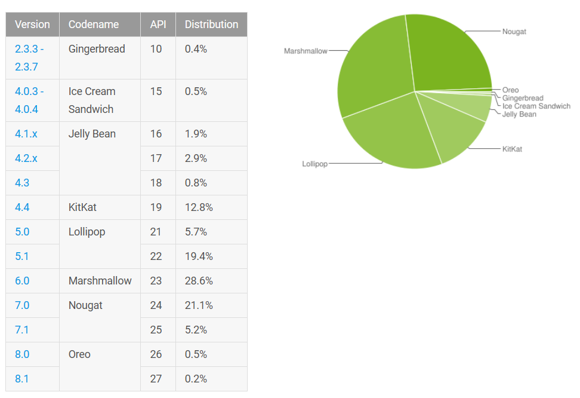

# Android App "Buy List" with Appium testing 

## **Project tools and libraries used**  
- ***Selenium*** and ***Appium*** client libraries for Java
- ***Spring Context*** for Appium driver type injection  
- ***TestNG*** as a main test run and tests suite framework arrangement
- ***Allure*** library allows to use specific annotations that will be reflected  
in the corresponding Allure report. ***Allure plugin for Maven*** allows to generate  
HTML reports automatically with Maven lifecycle phases. ***Allure adapter for TestNG***  
integrates tests suites with Allure reporting
- ***AssertJ*** library is used for assertions customization  
  
`src/main/resources/` contains `app` directory where target application apk file   
is located;  
also here Allure and Application properties files are kept.    
The last one specify some properties extracted from Android driver configuration.

## **Test run**
- **Appium Driver type** is configurable via JVM options parameter: `-DdriverType=Android`.  
This flag is being passed into factory method `getDriverByType()` via Spring IoC configuration.  
By default, it is being instantiated as "Android".
There is also setting `-DlaunchApium`: Appium local service will be started automatically if `true`, or
will try to connect to pre-launched service if `false`
- Start **Appium** server manually if you pass `-DlaunchApium` as `false`. For automatic launch (if `true`), it is
required that Appium is installed via NPM
- `application.properties`: specify **device** you have. It is not need to start **Android device [emulator]**, it
will be started automatically thanks to *capability* `avd` in driver setup. Note: it is eqired you have ANDROID_HOME
environmental var defined.
- Run tests (either single test method/test class or all tests included into  
`src/test/resources/al-tests.xml`) with right click -> 'Run tests' in IDE or  
creating run configurations *TestNG* and specifying test suites/methods manually

- To run tests with Maven with Allure test report generation:
`mvn clean test site`  
Allure report in HTML format will be output into `target\site\allure-maven-plugin` directory

## **Test project structure**
Project consists of the following main parts:
- *Data*: custom types for test data composition.   
`Currency` provides available currency symbols; `Category` reflects existing goods categories;  
`ListItemInfo`, `ListItemDisplaySettings`, `CategoryReOrderInfo` incapsulate complex data that are supposed to be provided to the app.
- *Utils*: helper classes and methods.  
`AppiumDriverFactory` contains methods to resolve Appium Driver of certain type (Android only for now)  
`ReportUtils` - static methods for Allure reporting attachments  
`RandomUtils` - random data generator  
`DriverManager` encapsulates driver with waiter logic and exposes driver instance; `ExecutionContext` for managing execution retry logic; `DataContextUtils` for application data management 
- *Pages*: page objects for application. All pages extend `PageElements` base class and are being instantiated passing driver instance to base constructor which initializes elements
Page object can contain the following fields to expose to higher level of abstraction:  
  - MobileElement;  
  - MobileBy locator;  
  - Template for location strategy (String type)  
AppiumDriver instance is injected into all Pages' constructors  
This instance is being passed into page objects from the *Managers* layer  
- *Managers* stand between test scenarios and page objects: they compose steps to interact with page objects from tests  
- *Tests* classes extend BaseTest and inherited driver instance to operate on.  

## **Application under test**  

Application to be tested: *Shopping List*
It contains general functionality for creating/editing list of goods to be bought, settings for currency and units of products to measure etc

At the time this project was being developed, the following Android version usage statistic presented:

Taking into consideration given statistic tests have been validated for the most popular 6 and 7 versions + the latest 8 for perspective  

   

 ## **Reports**
 
 Allure report overview looks like:  
 
   
 
 Test cases (group by TestNG suites and named as in suite XML file) can be viewed here:  
 
  
 
 Group by Features and Stories (derived and resolved fgrom Allure annotations):   
 
   
  
  Thanks to Step annotation and method's parameters binding, we can see test scenario step-by-step with particular data passed into test step:  
  
  
   
 Also we can see useful text attachments - this one reflects the list of item before and after drag & drop action:  
 
 
 
  
We can see failed test by assertion because of existing issue (Allure Issue annotation):  

  
Screenshots for issues captured and attached to the Report:

